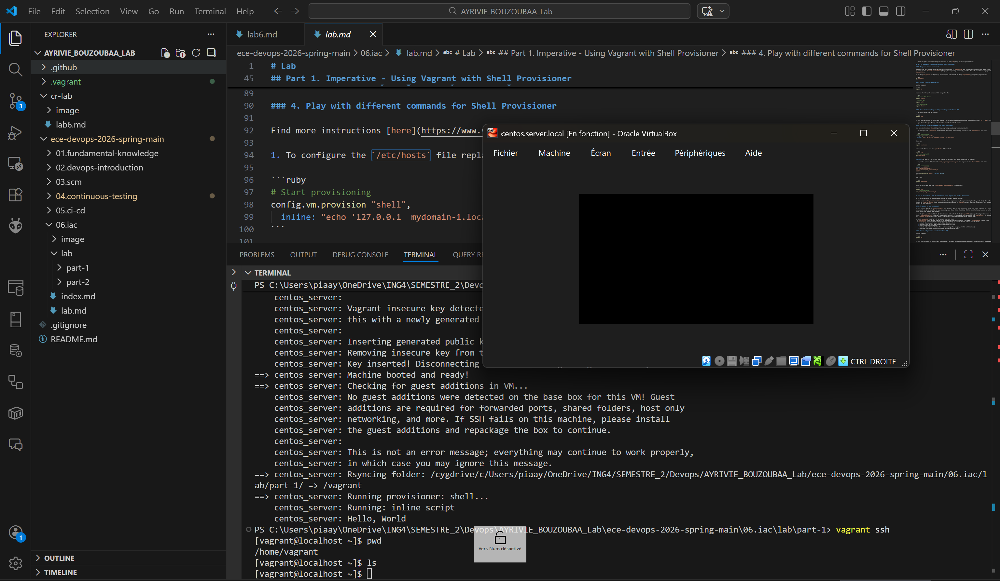
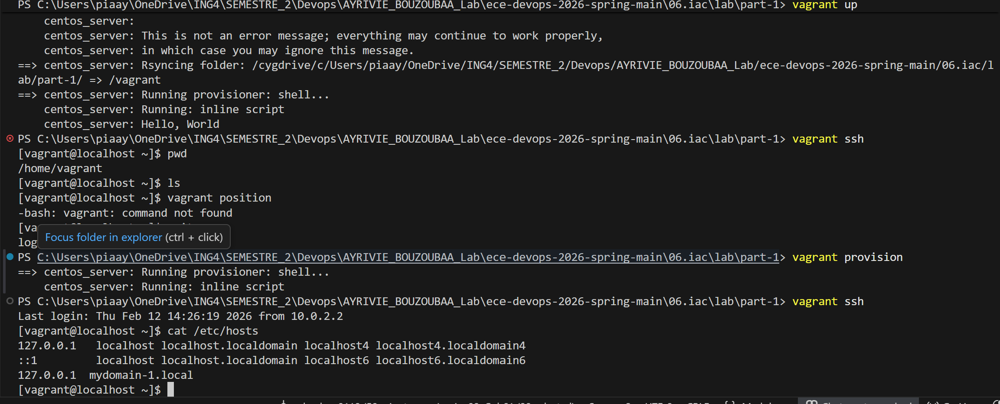
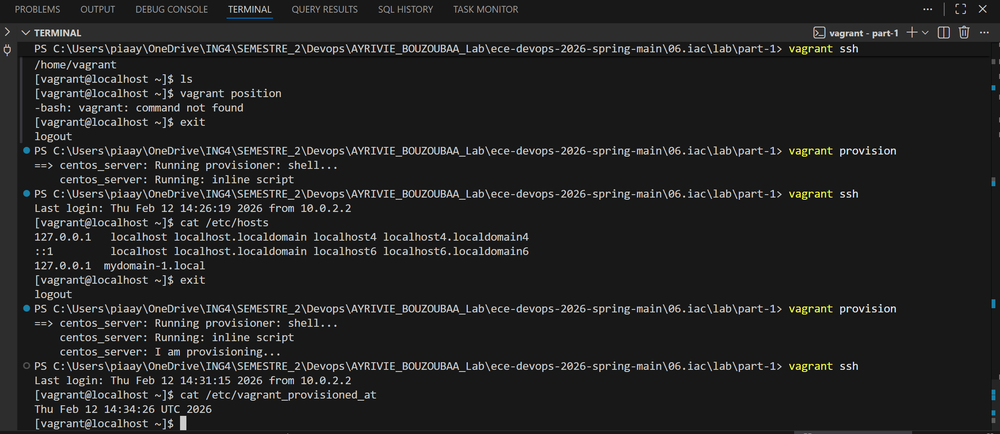

# Compte Rendu de Lab

---

## 1️) Objectif du Lab

**Description de l’objectif :**

> Décrire ici le but principal du lab.
> Quel problème devait être résolu ?
> Quelle compétence ou technologie devait être mise en pratique ?

## **Résultats attendus :**

*
*

---

## 2️) Possible Application dans le Monde Réel

Décrire comment ce lab pourrait être utilisé dans un contexte professionnel.

* Exemple d’entreprise ou secteur concerné :
* Cas d’usage concret :
* Valeur ajoutée pour une organisation :

---

## 3️) Étapes dans le Cycle DevOps (Justification Obligatoire)

| Étape DevOps | Description de ce qui a été fait | Justification |
| ------------ | -------------------------------- | ------------- |
| Plan         |                                  |               |
| Code         |                                  |               |
| Build        |                                  |               |
| Test         |                                  |               |
| Release      |                                  |               |
| Deploy       |                                  |               |
| Operate      |                                  |               |
| Monitor      |                                  |               |

> Adapter les étapes si nécessaire selon le lab.

---

# PARTIE 1 — Imperative : Using Vagrant with Shell Provisioner

## 1. Prepare a virtual environment

### Explication détaillée des commandes exécutées

```
cd lab/part-1
```

Permet de se placer dans le dossier contenant le Vagrantfile. Vagrant fonctionne à partir du répertoire courant contenant ce fichier de configuration.

```
vagrant up
```

Commande principale qui :

- Télécharge la box si elle n’est pas présente

- Crée la machine virtuelle

- Configure le réseau

- Exécute le provisioning défini dans le Vagrantfile

        Cela automatise totalement la création de l’environnement.


```
vagrant ssh
```

Permet d’entrer dans la VM via SSH.

**Objectif** : interagir directement avec le système Linux pour vérifier la configuration.



7️⃣ Modification du /etc/hosts via Shell Provisioner

Code ajouté dans le Vagrantfile :

```ruby
config.vm.provision "shell":
    inline: "echo '127.0.0.1  mydomain-1.local' >> /etc/hosts"
````

**Pourquoi ?**
 Cela permet d’automatiser une modification système lors du provisioning. On applique une configuration réseau personnalisée.

Commande exécutée :
```
vagrant provision
```

Cette commande réapplique uniquement la partie provisioning sans recréer la VM.

Vérification :

```
ruby
cat /etc/hosts
```

📸 Lien capture écran :




8️⃣ Création du fichier /etc/vagrant_provisioned_at

Code ajouté :

```
ruby
$script = <<-SCRIPT
echo I am provisioning...
date > /etc/vagrant_provisioned_at
SCRIPT
```


config.vm.provision "shell", inline: $script

Pourquoi ? Ce script démontre que le provisioning peut exécuter plusieurs commandes et créer des fichiers système automatiquement.

Commande exécutée :
```
vagrant provision
```

Vérification :

cat /etc/vagrant_provisioned_at

Cela permet de confirmer que le script s’est exécuté correctement et à quelle date.




---


# PARTIE 2: Declarative - GitLab installation using Vagrant and Ansible Provisioner 


---

## 4️) Problèmes Rencontrés Lors du Lab

| Message d’erreur / Problème | Processus de Résolution |
| --------------------------- | ----------------------- |
|                             |                         |
|                             |                         |
|                             |                         |
|                             |                         |

---

## 5️) Conclusion

### ✔️ L’objectif du lab est-il rempli ?

> Répondre clairement par Oui / Partiellement / Non et justifier.

### 🎯 Ce que j’ai appris

*
*
*

### 🔄 Améliorations possibles

*
*
*

---
