# Compte Rendu de Lab 06 - Infrastructure as Code

---

## 1) Objectif du Lab

**Description de l'objectif :**

Ce lab a pour objectif d'appliquer l'approche Infrastructure as Code (IaC) selon deux modes:
- Imperatif: provisionner une VM avec Vagrant et Shell Provisioner.
- Declaratif: installer GitLab avec Vagrant + Ansible, puis automatiser les checks de sante.

Le probleme traite est la mise en place d'un environnement reproductible, automatisable et testable, au lieu d'une installation manuelle fragile.

Concretement, l'objectif est de transformer des operations manuelles en code d'infrastructure. En pratique, cela signifie que l'environnement peut etre relance plusieurs fois, sur plusieurs machines, avec le meme resultat fonctionnel.

**Resultats attendus :**
- Une VM CentOS/7 fonctionnelle pour la partie imperative.
- Une VM `gitlab_server` provisionnee automatiquement avec GitLab accessible sur `http://localhost:8080`.
- Des checks applicatifs automatises (`health`, `readiness`, `liveness`) executes via Ansible.
- Une trace claire des executions et validations via captures d'ecran.

---

## 2) Possible application dans le monde reel

* Exemple d'entreprise ou secteur concerne : ESN, editeur logiciel, startup SaaS, equipe IT d'une grande entreprise.
* Cas d'usage concret : deploiement automatique d'une plateforme GitLab de test/preproduction avec verification de disponibilite du service. Une equipe peut recreer rapidement un environnement propre pour valider une mise a jour.
* Valeur ajoutee pour une organisation : reduction des erreurs manuelles, gain de temps de deploiement, standardisation des environnements et meilleure observabilite. La connaissance technique est capitalisee dans les fichiers IaC et non dans des manipulations ponctuelles.

---

## 3) Etapes dans le Cycle DevOps (Justification Obligatoire)

| Etape DevOps | Description de ce qui a ete fait | Justification |
| ------------ | -------------------------------- | ------------- |
| Plan | Verification des prerequis (VirtualBox, Vagrant, box `centos/7`) et lecture des objectifs du TP. | Definir le cadre avant execution evite les erreurs de sequence. |
| Code | Modification des fichiers IaC (`Vagrantfile`, role Ansible `gitlab/healthchecks`). | L'infrastructure devient versionnable et reproductible. |
| Build | Creation/provisionnement des VMs via `vagrant up`. | Produit un environnement complet pret a l'emploi. |
| Test | Validation par `vagrant ssh`, `curl`, et `ansible-playbook --tags check`. | Confirme que les services fonctionnent et repondent correctement. |
| Release | Mise a jour des playbooks locaux et preparation de leur envoi vers la VM. | Formalise la publication d'une nouvelle configuration. |
| Deploy | `vagrant upload` puis `vagrant provision` pour reappliquer les changements. | Applique les modifications de maniere coherente sur la cible. |
| Operate | Exploitation de GitLab (`localhost:8080`, acces root, commandes de gestion VM). | Correspond a l'usage operationnel du service deploye. |
| Monitor | Checks `/-/health`, `/-/readiness`, `/-/liveness` et affichage des resultats en console. | Permet la surveillance et la detection rapide d'anomalies. |

---

# PARTIE 1 - Imperative: Using Vagrant with Shell Provisioner

## 1. Preparation de l'environnement virtuel

Commandes executees:

```bash
cd lab/part-1
vagrant up
vagrant ssh
```

Resultat: la VM `centos_server` est creee et accessible.

Explication de l'etape:
- `vagrant up` cree la machine virtuelle, configure le reseau et lance le provisioning defini dans le `Vagrantfile`.
- `vagrant ssh` valide la connectivite et confirme que la VM est exploitable.
- Cette etape pose la base technique avant d'aller vers les modifications systeme.

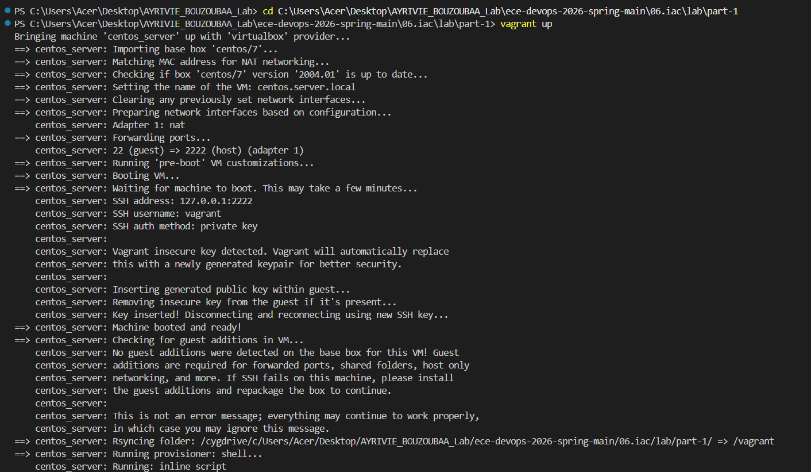
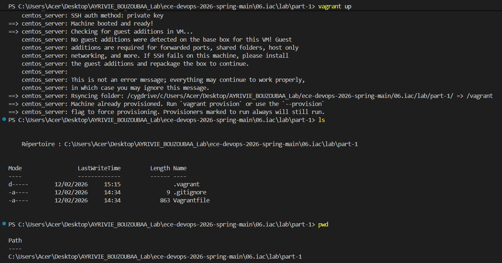


## 2. Commandes de gestion VM

Commandes testees:

```bash
vagrant status
vagrant halt
vagrant destroy
```

Explication de l'etape:
- `status` permet de verifier rapidement l'etat courant de la VM.
- `halt` arrete proprement la machine (utile pour maintenance ou economie de ressources).
- `destroy` supprime la VM pour repartir d'un environnement propre.

Captures:

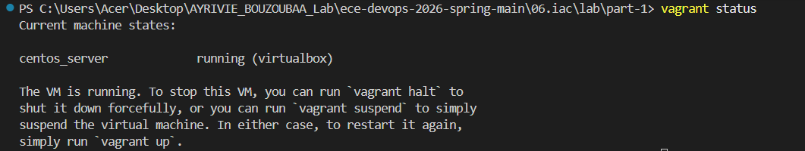

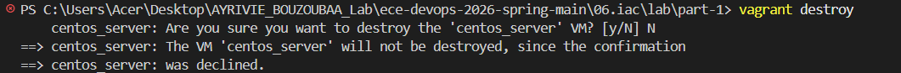

## 3. Shell Provisioner - modification de `/etc/hosts`

Modification du `Vagrantfile` (provisioning shell), puis execution:

```bash
vagrant provision
vagrant ssh
cat /etc/hosts
```

Validation: l'entree `mydomain-1.local` est bien ajoutee.

Explication de l'etape:
- Cette partie illustre l'approche imperative: on execute explicitement une commande shell.
- `vagrant provision` rejoue uniquement le provisioning, sans recreer la VM.
- La verification dans `/etc/hosts` confirme que la commande a ete appliquee.


## 4. Shell Provisioner - creation de `/etc/vagrant_provisioned_at`

Execution du script shell avec la commande `date` dans le `Vagrantfile`, puis:

```bash
vagrant provision
vagrant ssh
cat /etc/vagrant_provisioned_at
```

Validation: la date de provisioning est bien ecrite dans le fichier.

Explication de l'etape:
- Le script montre qu'on peut enchainer plusieurs commandes shell dans un provisioning.
- Le fichier genere sert de preuve d'execution et de trace temporelle.
- Cette verification est utile pour le debug et pour prouver l'automatisation.


---

# PARTIE 2 - Declarative: GitLab installation using Vagrant and Ansible Provisioner

## 1. Provisionnement GitLab

Depuis `lab/part-2`, execution:

```bash
vagrant up
```

Resultat: les taches Ansible d'installation GitLab s'executent avec succes.

Explication de l'etape:
- Ici, on travaille en declaratif: on decrit l'etat cible (packages, services, configuration) et Ansible l'applique.
- Le recap Ansible (`ok`, `changed`, `failed`) permet d'evaluer rapidement la qualite du provisionnement.

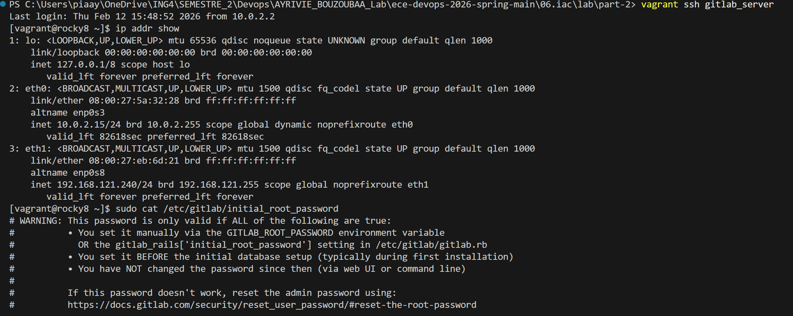

## 2. Verification de l'installation

Verifications realisees:
- Connexion a la VM GitLab en SSH.
- Recuperation/verification des informations de connexion initiale.
- Verification de l'etat de la VM dans VirtualBox.

Explication de l'etape:
- Cette phase confirme que GitLab est installe et que la VM est operationnelle.
- Verifier la connexion root est important pour l'administration initiale de l'instance.

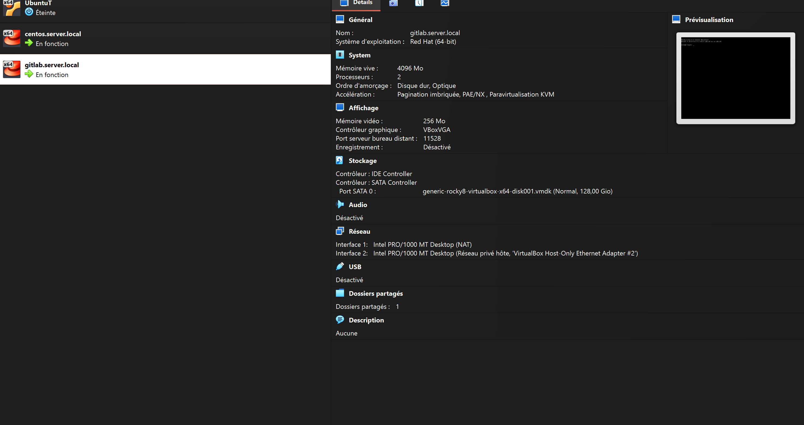
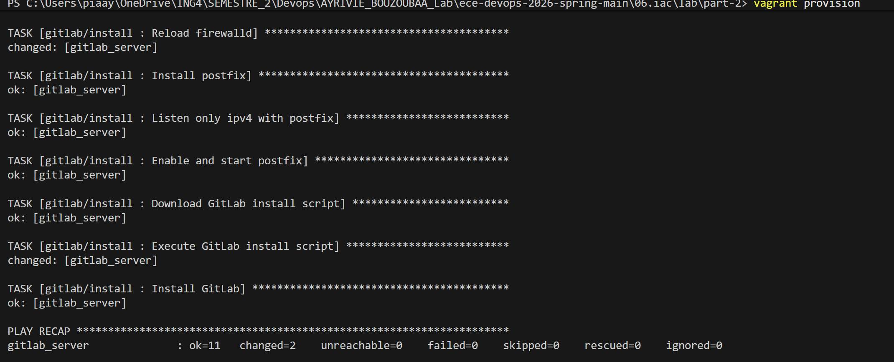

## 3. Mise a jour des playbooks et re-provisioning

Commandes executees:

```bash
vagrant upload playbooks /vagrant/playbooks gitlab_server
vagrant provision
```

Resultat: les playbooks sont uploades puis reappliques correctement.

Explication de l'etape:
- `vagrant upload` pousse les modifications locales vers la VM cible.
- `vagrant provision` rejoue le playbook avec les nouvelles modifications.
- Cette sequence reproduit un flux de livraison d'infrastructure: modifier, publier, deployer.

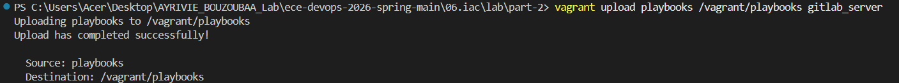
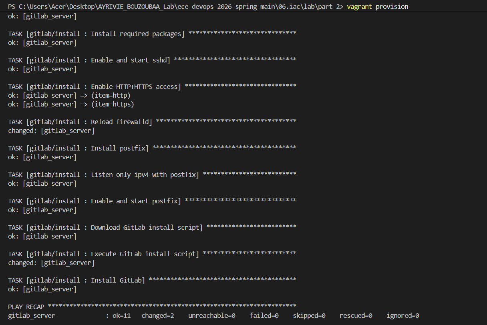

---

# PARTIE 3 - Declarative: Configure a health check for GitLab

## 1. Health check simple avec curl

Commande executee dans la VM:

```bash
curl http://127.0.0.1:8080/-/health
```

Resultat obtenu: `GitLab OK`.

Explication de l'etape:
- Ce check valide que l'application repond bien au niveau HTTP.
- C'est une verification rapide avant d'aller vers des checks plus detailles.

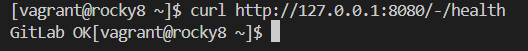
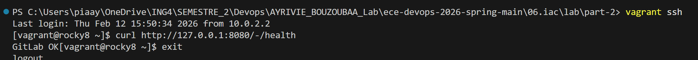

## 2. Execution du role `gitlab/healthchecks`

Commande executee:

```bash
ansible-playbook /vagrant/playbooks/run.yml --tags check -i /tmp/vagrant-ansible/inventory/vagrant_ansible_local_inventory
```

Resultat: le role s'execute avec succes et affiche le message de health check.

Explication de l'etape:
- Le tag `check` permet d'executer uniquement la partie healthchecks, sans relancer toute l'installation GitLab.
- Cette approche rend les tests plus rapides et plus cibles pendant le developpement du playbook.

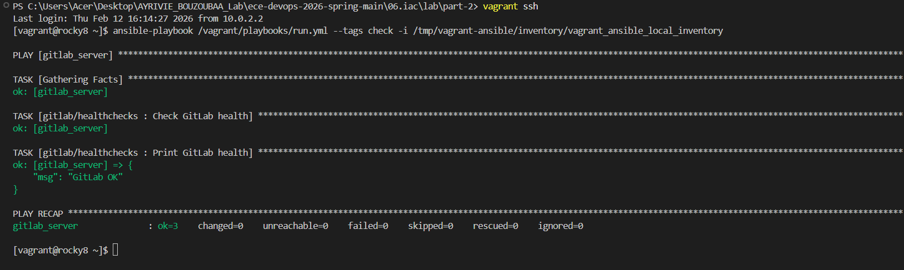


## 3. Ajout et execution des checks Readiness + Liveness

Le fichier `playbooks/roles/gitlab/healthchecks/tasks/main.yml` a ete complete pour inclure:
- `http://127.0.0.1:8080/-/readiness`
- `http://127.0.0.1:8080/-/liveness`

Resultat: affichage des reponses JSON avec statut `ok`.

Explication de l'etape:
- `health` verifie que le service repond globalement.
- `readiness` verifie que l'application est prete a traiter des requetes (etat des composants internes).
- `liveness` verifie que le processus est vivant et non bloque.
- Ensemble, ces trois checks donnent une vision plus fiable de l'etat reel du service.

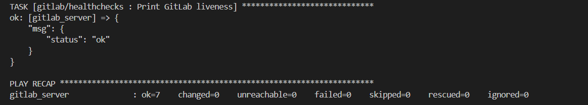
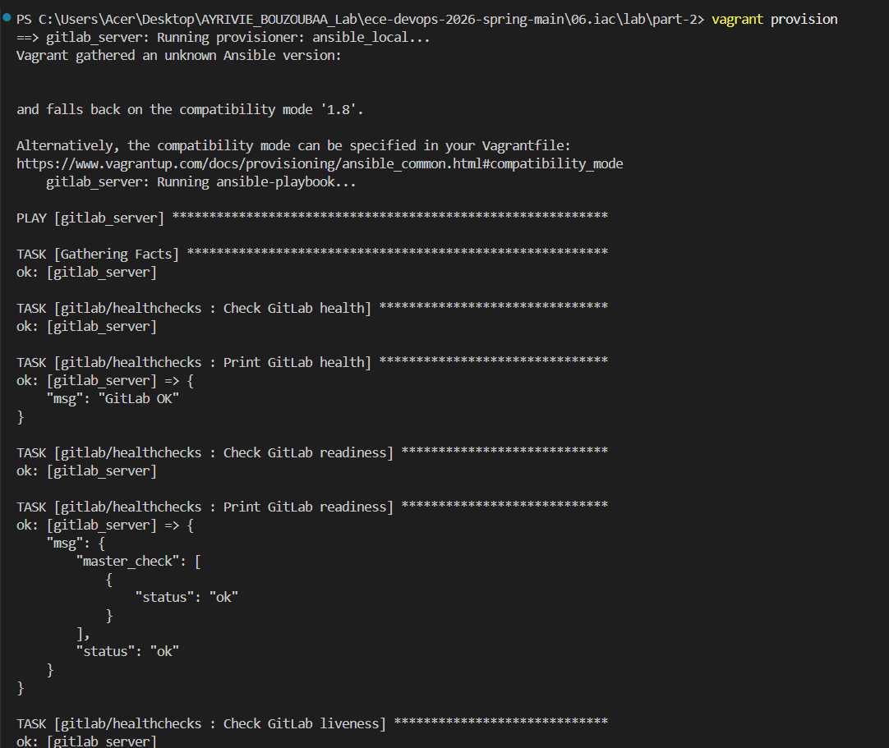

---

## 4) Problemes rencontres lors du lab

| Message d'erreur / Probleme | Processus de resolution |
| --------------------------- | ----------------------- |
| `vagrant: command not found` execute dans la VM SSH | Comprendre que les commandes Vagrant se lancent sur la machine hote, pas dans la VM. |
| Message VirtualBox Guest Additions non detecte | Message non bloquant dans ce contexte, poursuite du lab sans impact fonctionnel majeur. |
| `vagrant destroy` annule (confirmation `N`) | Relancer au besoin et confirmer explicitement la suppression selon le besoin. |
| Message de compatibilite Ansible Vagrant (`compatibility mode 1.8`) | Provisioning continue normalement; verification des taches et du recap (`failed=0`). |

---

## 5) Conclusion

### L'objectif du lab est-il rempli ?

**Oui.**
Les trois parties du TP sont couvertes: provisioning imperatif, installation declarative GitLab, puis automatisation des checks `health/readiness/liveness` avec affichage des resultats.

Ce resultat montre que l'objectif pedagogique est atteint: savoir decrire, provisionner et verifier une infrastructure sous forme de code.

### Ce que j'ai appris

- Utiliser Vagrant pour creer, gerer et reconfigurer rapidement des VMs.
- Differencier les approches imperative (shell) et declarative (Ansible).
- Mettre en place des verifications de disponibilite applicative et les automatiser via un playbook.
- Interpreter un recap Ansible (`ok`, `changed`, `failed`) pour valider un deploiement.
- Structurer le travail selon un cycle DevOps complet (Plan a Monitor).

### Ameliorations possibles

- Ajouter le bonus: message personnalise listant uniquement les services en echec (readiness parse JSON).
- Ajouter une validation automatique des statuts (fail condition Ansible si `status != ok`).
- Integrer ces checks dans un pipeline CI/CD pour surveillance continue.
- Ajouter une section de rollback/documentation d'exploitation pour un usage equipe.

---
